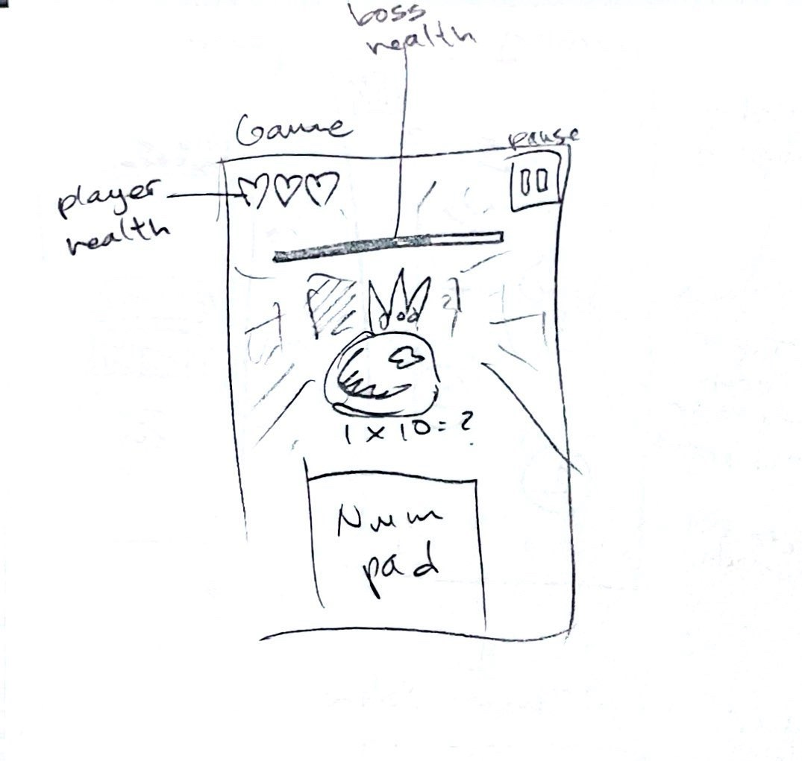

# Mult-Escape

## Description

**Mult-Escape** is an educational mobile game that makes learning multiplication fun for kids. Designed as an edutainment experience, it helps children practice math while being entertained—offering a smarter alternative to passive screen time like watching videos. With engaging gameplay and interactive challenges, Mult-Escape turns math learning into an adventure.

Set in a dungeon where the only way out is to defeat enemies using the power of multiplication, each level becomes progressively more challenging—encouraging skill growth and mastery along the way.

All sprites were hand-drawn by me, and GenAI was used as a development aid during the coding process.

## Proposal

### Must-Haves

#### Core Content:
A complete set of levels covering the 1s multiplication table, with teaching and gameplay views.

#### Gameplay Loop:
- Level 1:
  - Teaching Views: 1×1, 1×2, 1×3  
  - Game View: 1×1, 1×2, 1×3 (level boss)

- Level 2:
  - Teaching Views: 1×4, 1×5, 1×6
  - Game View: 1×4, 1×5, 1×6 (level boss)

- Level 3:
  - Teaching Views: 1×7, 1×8, 1×9
  - Game View: 1×7, 1×8, 1×9 (level boss)

- Level 4:
  - Teaching Views: 1×10, 1×11, 1×12
  - Game View: 1×10, 1×11, 1×12 (level boss)

- Level 5 (Boss Fight):
  - Cumulative Game View: 1×1 through 1×12
  - Boss has 12 health—one correct answer removes one health point.

#### Supporting Views:
- Title Screen
- Level Select Screen
- Pause Menu

#### Polish and Presentation:
- Fully polished UI using pixel art PNGs for a cohesive retro aesthetic
- Animated pixel art enemy sprites for visual engagement

---

### Nice-to-Haves

- Sound effects and background music

- Additional multiplication sets (2s through 12s), time permitting

- Unique enemy types per number (e.g., slimes for 1s, zombies for 2s, etc.)

- Save game progress to local device storage

- Use of SpriteKit for performance optimization and improved development workflow (may not be feasible due to hardware constraints)

---

## Wireframes

---

## Submission

### Must-have Checklist

✅ **Core Content:**
  - ✅ A complete set of levels covering the 1s multiplication table, with teaching and gameplay views.

✅ **Gameplay Loop:**
- ✅ Level 1:
  - ✅ Teaching Views: 1×1, 1×2, 1×3
  - ✅ Game View: 1×1, 1×2, 1×3 (level boss)

- ✅ Level 2:
  - ✅ Teaching Views: 1×4, 1×5, 1×6
  - ✅ Game View: 1×4, 1×5, 1×6 (level boss)

- ✅ Level 3:
  - ✅ Teaching Views: 1×7, 1×8, 1×9
  - ✅ Game View: 1×7, 1×8, 1×9 (level boss)

- ✅ Level 4:
  - ✅ Teaching Views: 1×10, 1×11, 1×12
  - ✅ Game View: 1×10, 1×11, 1×12 (level boss)

- ✅ Level 5 (Boss Fight):
  - ✅ Cumulative Game View: 1×1 through 1×12

✅ **Supporting Views:**
- ✅ Title Screen
- ✅ Level Select Screen
- ✅ Pause Menu

✅ **Polish and Presentation:**
- ✅ Fully polished UI using pixel art PNGs for a cohesive retro aesthetic
- ✅ Animated pixel art enemy sprites for visual engagement

### Nice-to-Haves Checklist

- ❌ Sound effects and background music
  - Programming the game and drawing all the sprites from scratch took up all development time, so sound was ultimately cut.

- ❌ Additional multiplication sets (2s through 12s), time permitting
  - Developing the 1s multiplication game loop was time-consuming and sufficient to demonstrate the core gameplay. The other sets would reuse the same structure.

- ❌ Unique enemy types per number (e.g., slimes for 1s, zombies for 2s, etc.)
  - Creating the current sprites took significant effort. Drawing unique enemies for all 12 sets would be unrealistic within a semester.

- ✅ Save game progress to local device storage
  - This turned out to be straightforward to implement.

- ❌ Use of SpriteKit for performance optimization and improved development workflow (may not be feasible due to hardware constraints)
  - My 2019 MacBook Pro couldn’t handle SpriteKit efficiently, so I stuck with SwiftUI.
